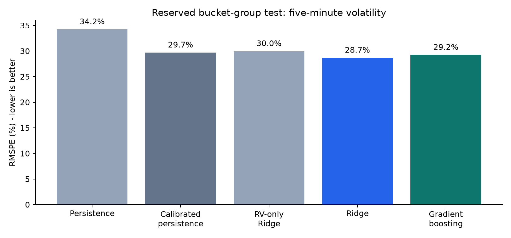
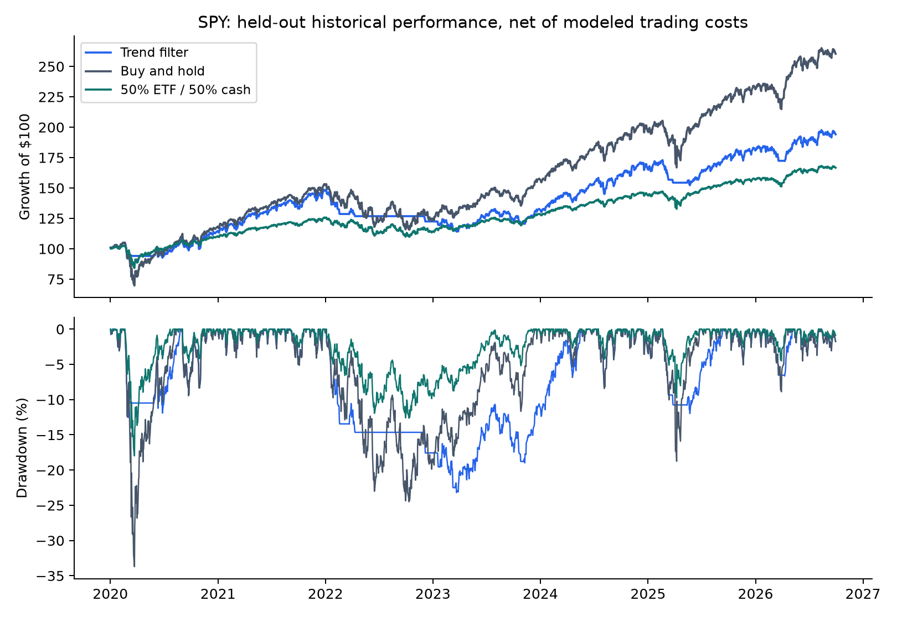

# Market data research and trading strategy evaluation

I studied two questions. Can order-book and trade data improve a forecast of short-horizon volatility? How does a simple trend rule change the balance between investment return and drawdown?

The first study uses public Optiver records. The second uses dated SPY, QQQ and IWM prices. They are separate experiments. The volatility forecasts do not generate the ETF trades.

## Start here

- [Research memorandum](06_Reports/Market_Research_Memorandum.pdf): findings, charts and conclusions.
- [Analysis notebook](02_Notebooks/Market_Research_Analysis.ipynb): calculations and saved-result tables.
- [Model scores](04_Results/optiver_model_scores.csv) and [strategy results](04_Results/strategy_performance.csv).
- [Research plan](03_Code/research_plan.json): split definitions, model settings, timing and cost assumptions.

## What I found

The order-book study covers 4,393,489 quote and trade records across three anonymized stocks. After coverage checks, 11,488 stock/time buckets remain. First-five-minute features predict realized volatility in the second five minutes.

| Reserved-test comparison | RMSPE |
| --- | ---: |
| Repeat the first-half volatility | 34.22% |
| Calibrated repeat-volatility forecast | 29.69% |
| Previous-volatility/stock-ID Ridge | 29.96% |
| Full Ridge model | 28.67% |

The apparent gain depends on the baseline. Ridge reduces error by 16.2% against a simple repeat forecast, but by 3.4% against its calibrated version. The grouped-bootstrap interval for the smaller gain includes zero. This is a modest predictive result, not evidence of a profitable trade.



The primary strategy holds SPY above its trailing 200-session price average and otherwise holds cash. A closing signal executes at the next session's close. The main test charges 5 basis points on one-way traded notional, assumes zero cash interest and uses no leverage.

| January 2020 to September 2026 | Annualized growth | Annualized volatility | Maximum drawdown |
| --- | ---: | ---: | ---: |
| Trend rule | 10.36% | 12.41% | -23.20% |
| Buy and hold | 15.29% | 20.05% | -33.72% |
| Daily-rebalanced 50% SPY / 50% cash | 7.89% | 10.02% | -17.98% |

The trend rule reduced market risk and also gave up return. The 50% stock/cash benchmark had an even smaller drawdown. I would evaluate the rule against a portfolio's purpose rather than recommend it simply because drawdown improved.



## How I tested it

Python, pandas and NumPy handle the market records and portfolio calculations. Scikit-learn fits Ridge and gradient-boosting forecasts. SQL/SQLite checks processed-data keys, split membership and price-date uniqueness.

Optiver time IDs are shuffled. All stocks sharing one time ID remain in the same training, validation or test group. This prevents overlap across simultaneous observations, but it is not chronological validation. The five-minute target is my reconstruction, not the original competition's subsequent-ten-minute target.

The ETF test uses development, validation and later historical periods. The 200-session rule was fixed before examining its results. Additional costs, lookbacks, execution delays and QQQ/IWM comparisons are sensitivity checks. They do not replace the original rule with whichever variant looks best.

I checked future-information isolation, independently reconciled portfolio accounting with a cash/units ledger, and recalculated performance metrics. A complete local rerun reproduced 23 principal result files from the same cached inputs.

## Reproduce the analysis

Use Python 3.12. From the repository folder:

```sh
python -m venv .venv
source .venv/bin/activate
pip install -r 03_Code/requirements.txt
python 03_Code/download_data.py
python 03_Code/run_all.py
```

Raw vendor files and the local environment are excluded from this repository. The downloader records source URLs and checksums. Optiver files come from a fixed public-mirror commit. Yahoo adjusted-price history can be revised, so a fresh download may differ from the saved results. The published manifest documents the October 7, 2026 snapshot used here.

Generated features and the SQLite database go in `01_Data/processed`. Reports go in `06_Reports`. The notebook reads saved results and can rerun the analysis with these dependencies.

## Sources and scope

- [Optiver competition data](https://www.kaggle.com/competitions/optiver-realized-volatility-prediction/data) and [host clarification about the buckets](https://www.kaggle.com/competitions/optiver-realized-volatility-prediction/discussion/249752).
- [Fixed-commit public data mirror](https://github.com/KenChiang1997/Optiver-Realized-Volatility-Prediction/tree/c23a8f4feab7834106703d3e035a1fddc40234c4).
- Yahoo Finance chart API, with exact requests in [the source manifest](01_Data/source_manifest.json).
- [SPY fund information](https://www.ssga.com/us/en/individual/etfs/state-street-spdr-sp-500-etf-trust-spy).
- [Scikit-learn validation guidance](https://scikit-learn.org/stable/modules/cross_validation.html) and [Ridge documentation](https://scikit-learn.org/stable/modules/generated/sklearn.linear_model.Ridge.html).
- [Faber's moving-average research](https://mebfaber.com/2009/02/19/a-quantitative-approach-to-tactical-asset-allocation-updated/) for background. My daily timing and cost assumptions are different from the paper's monthly implementation.

This is a public-data research case completed in October 2026. All trades are simulated. It does not represent employment at Optiver, an actual managed account or live investment performance.
